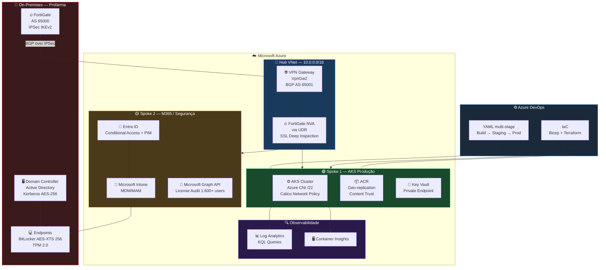

<div align="center">

<!-- BANNER ANIMADO -->


# Alexandre Lima
### Azure DevOps Engineer | AKS | IaC Bicep | Microsoft 365 | Intune MDM/MAM | Entra ID | Governança & FinOps


</div>

---

## 🧑‍💻 Sobre

Profissional com **+20 anos em engenharia de infraestrutura enterprise**, especializado em operação, automação e segurança de clusters Kubernetes no Azure (AKS). Experiência em pipelines CI/CD via Azure DevOps (YAML multi-stage), IaC com Bicep e Terraform, e observabilidade com Log Analytics KQL. Histórico de operação de ambientes com **200+ workloads** em topologia Hub-Spoke, integração híbrida FortiGate VPN BGP, e governança via Azure Policy, RBAC e PIM. Atuação em M365 com administração de **1.600+ usuários** via Microsoft Intune, Entra ID e Graph API.

---

## 🛠️ Stack Técnico

```yaml
role:     Azure DevOps Engineer
company:  W4Clouds Brasil — alocado na Profarma / Rede d1000
location: Rio de Janeiro, RJ — Remoto / Híbrido

kubernetes:
  - AKS node pools System (D4s_v3) / User (D8s_v3), Cluster Autoscaler, KEDA
  - Azure CNI, subnet /22 para IPAM de pods, Network Policy Calico
  - Managed Identity AcrPull, OPA/Gatekeeper, Pod Disruption Budgets
  - Private Cluster, Private Endpoints ACR/KeyVault/Storage

cicd:
  - Azure DevOps Pipelines YAML multi-stage, environments, approvals, gates
  - Docker multi-stage build, ACR geo-replication, Content Trust
  - Rollback automático em falha de deployment gate

iac:
  - Bicep modules parametrizados por ambiente dev/hml/prd
  - Terraform provider azurerm 3.x, remote backend state locking (Blob lease)
  - PowerShell Az module — automação operacional e compliance

observabilidade:
  - Log Analytics KQL — CrashLoopBackOff, CPU node, restart count
  - Container Insights, Application Insights .NET dependency tracking

seguranca:
  - NSG deny-all-default, Azure Policy 12+ initiatives, RBAC custom roles
  - PIM JIT 8h, FortiGate NVA VPN site-to-site IKEv2/IPSec BGP AS65001/AS65000

m365_intune:
  - Entra ID Conditional Access, BitLocker AES-XTS 256 via Intune MEM
  - Graph API — auditoria automatizada de 1.600+ licenças M365 E3
  - MDM/MAM compliance policies integradas ao Conditional Access

finops:
  - Cost Management rightsizing, Reserved Instances, Power BI chargeback
  - Redução 18% custo compute via rightsizing B4ms→B2s documentado
```

---

## 🏗️ Arquitetura de Referência — Hub-Spoke AKS + FortiGate NVA



---

## 🎬 Arquitetura em Movimento

<div align="center">

</div>

> Fluxo de tráfego: VPN BGP on-prem ↔ Azure, FortiGate NVA inspecionando tráfego East-West, AKS workloads com Network Policy Calico, Intune gerenciando endpoints via MDM.

---

## 📁 Projetos em Destaque

| Projeto | Descrição | Stack |
|---------|-----------|-------|
| CVE-2026-20833 RC4/Kerberos | Assessment C4 Level 4 e plano de remediação 5 fases para AD Kerberos | PowerShell, AD, KDCSVC |
| M365 E3 License Audit | Auditoria automatizada 1.600+ licenças via Graph API + dashboard Excel | Python, Graph API, openpyxl |
| Azure RG Activity Auditor | 90 dias de Activity Logs por Resource Group com exportação Excel colorido | Python, Azure REST API |
| AKS Hub-Spoke Deployment | Cluster AKS privado com Azure CNI /22, Calico, OPA/Gatekeeper via Bicep | Bicep, Terraform, AKS |

---

## 🏅 Badges

<div align="center">


</div>

